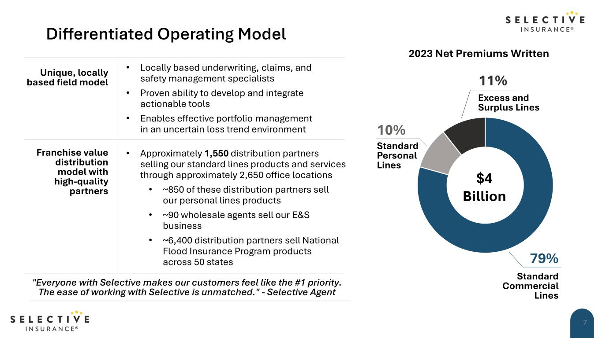

# 🧑‍🍳 VLM-1 Cookbook

A collection of examples built on top of **VLM-1**, an API for **structured visual understanding** of images, videos and documents.


## Why VLM-1?
- 📦  **Structured Outputs**:  VLM-1 provides structured predictions (e.g. JSON) for your images/videos/documents, allowing you to easily automate visual tasks with strongly-typed and validated outputs.
- 🎯  **Fine-tuning**: VLM-1 can be fine-tuned for specific visual domains, allowing you to achieve the desired accuracy for your use-case with enterprise-level SLAs.
- 💸  **Scalable**: VLM-1 is optimized to be cost-effective for high data volumes, enabling you to scale your visual automation workflows without being rate-limted or incurring large bills.
- 🛡️  **Private Deployments**: VLM-1 can be deployed on-prem or in a private cloud, allowing you to keep your data private and secure, and work with privacy-sensitive material.

## Signup for Early Access

If you're interested in using **VLM-1** for your structured visual understanding workflows, please sign up for early access [here](https://airtable.com/appjX6543bChjNaEN/pagnciKtynSt4rOT9/form). We're currently working with a select group of partners to fine-tune the API and would love to hear from you if you have a specific use case in mind.


## Motivating Examples

| **Name** | **Colab / Notebook** | **Date** | **Domain** | **Author** |
|:---:|:---:|:---:|:---:|:---:|
| Financial Presentations | [](./examples/vlm-1-financial-presentations.ipynb) [](https://colab.research.google.com/github/autonomi-ai/vlm-cookbook/blob/main/examples/vlm-1-financial-presentations.ipynb)  | 03-27-2024 | `document.presentation` | [@spillai](https://github.com/spillai) |
| Hybrid document search with ChromaDB | [](./examples/chroma-metadata-finance.ipynb) [](https://colab.research.google.com/github/autonomi-ai/vlm-cookbook/blob/main/examples/chroma-metadata-finance.ipynb)  | 04-04-2024 | `document.presentation` | [@outtanames](https://github.com/outtanames) |
| Financial TV News | [](./examples/vlm-1-financial-tv-news.ipynb) [](https://colab.research.google.com/github/autonomi-ai/vlm-cookbook/blob/main/examples/vlm-1-financial-tv-news.ipynb)  | 03-28-2024 | `tv.news` | [@spillai](https://github.com/spillai) |
| NBA Game Analysis | [](https://colab.research.google.com/drive/1jy62B-H1fwyNGvgyBS83_OhX5NJ9dpnm)  | 03-28-2024 | `sports.nba` | [@spillai](https://github.com/spillai) |
| Write NFL Plays to Airtable | [](https://colab.research.google.com/drive/1XhVG7Fl1O4m8uFS6bRgavj0mtJb5u1Qw#scrollTo=Pn03zLapza69)  | 03-29-2024 | `sports.nfl` | [@outtanames](https://github.com/outtanames) |


## What is Structured Visual Understanding?

VLMs like GPT4-Vision and Claude Vision support question answering over arbitrary visual inputs. In practice however, textual answers are not an ideal interface for many workflows, especially for automation. Instead, VLM-1 defines its API in
terms of fixed types for different visual inputs like financial documents, cable news and sporting events. This schema can be as simple
as a list of string values (see NFL example below) or more complicated with nested types. Let's look at an example for presentations (e.g. `document.presentation`) below:

**Example Input Image**




<br>

**Example JSON Output**
```json
{
  "description": "The slide presents a 'Differentiated Operating Model' for Selective Insurance, detailing their unique field model, franchise value, and distribution network. It also includes a pie chart showing the 2023 Net Premiums Written, with a total of $4 Billion distributed across different lines of insurance.",
  "title": "Differentiated Operating Model",
  "page_number": 7,
  "plots": [
    {
      "type": "pie",
      "title": "2023 Net Premiums Written",
      "description": "A pie chart showing the distribution of net premiums written by Selective Insurance in 2023, totaling $4 Billion. It is divided into three categories: Standard Commercial Lines (79%), Standard Personal Lines (10%), and Excess and Surplus Lines (11%).",
      "data": "| Category | Percentage | \n| --- | --- | \n| Standard Commercial Lines | 79% | \n| Standard Personal Lines | 10% | \n| Excess and Surplus Lines | 11% |",
      "caption": null
    }
  ],
  "tables": null,
  "others": [
    {
      "data": "### Unique, locally based field model\n- Locally based underwriting, claims, and safety management specialists\n- Proven ability to develop and integrate actionable tools\n- Enables effective portfolio management in an uncertain loss trend environment\n\n### Franchise value distribution model with high-quality partners\n- Approximately 1,550 distribution partners selling our standard lines products and services through approximately 2,650 office locations\n  - ~850 of these distribution partners sell our personal lines products\n  - ~90 wholesale agents sell our E&S business\n  - ~6,400 distribution partners sell National Flood Insurance Program products across 50 states\n\n> \"Everyone with Selective makes our customers feel like the #1 priority. The ease of working with Selective is unmatched.\" - Selective Agent",
      "caption": null,
      "title": null
    }
  ]
}
```

Let's unpack some of the keys in the JSON output above:

<details>
<summary><kbd>"others.data" (formatted)</kbd></summary>

### Unique, locally based field model
- Locally based underwriting, claims, and safety management specialists
- Proven ability to develop and integrate actionable tools
- Enables effective portfolio management in an uncertain loss trend environment

### Franchise value distribution model with high-quality partners
- Approximately 1,550 distribution partners selling our standard lines products and services through approximately 2,650 office locations
  - ~850 of these distribution partners sell our personal lines products
  - ~90 wholesale agents sell our E&S business
  - ~6,400 distribution partners sell National Flood Insurance Program products across 50 states

 "Everyone with Selective makes our customers feel like the #1 priority. The ease of working with Selective is unmatched." - Selective Agent
</details>


<details>
<summary><kbd>"plots.data" (formatted)</kbd></summary>

| Category | Percentage |
| --- | --- |
| Standard Commercial Lines | 79% |
| Standard Personal Lines | 10% |
| Excess and Surplus Lines | 11% |

</details>
<br>

As you can see from the JSON output above, the structured output is designed to be human readable and parseable (with [Pydantic](https://github.com/pydantic/pydantic) / strongly-typed data-structures) for downstream workflow automation. The output is also designed to be easily integrated with traditional databases like Postgres, MongoDB, or even tabular databases like Airtable, where the columns can be automatically mapped to elements in the schema.


## DB Integration

Structured outputs from unstructured data are a natural fit for traditional databases - with **VLM-1**, we can now extract structured content from images, videos, documents etc and index them alongside the raw data in a traditional DB. This allows us to go beyond simple embeddings and support hybrid search and retrieval flows that combine structured and unstructured data. If you're interested in integrating **VLM-1** with a DB, we're working on a number of integrations and would love to hear from you on [Discord](https://discord.gg/a6suHC9B5E) if you have an interesting use case you would like to see supported!


## 🔗  Quick Links

* 💬 Send us an email at [support@autonomi.ai](mailto:support@autonomi.ai) or join our [`#vlm-playground` Discord channel](https://discord.gg/a6suHC9B5E) for help.
* 📣 Follow us on [Twitter](https://twitter.com/autonomi\_ai), and [LinkedIn](https://www.linkedin.com/company/autonomi-ai) to keep up-to-date on our products.
